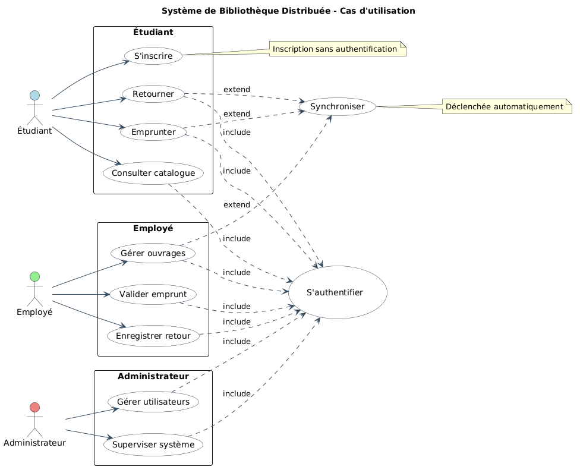
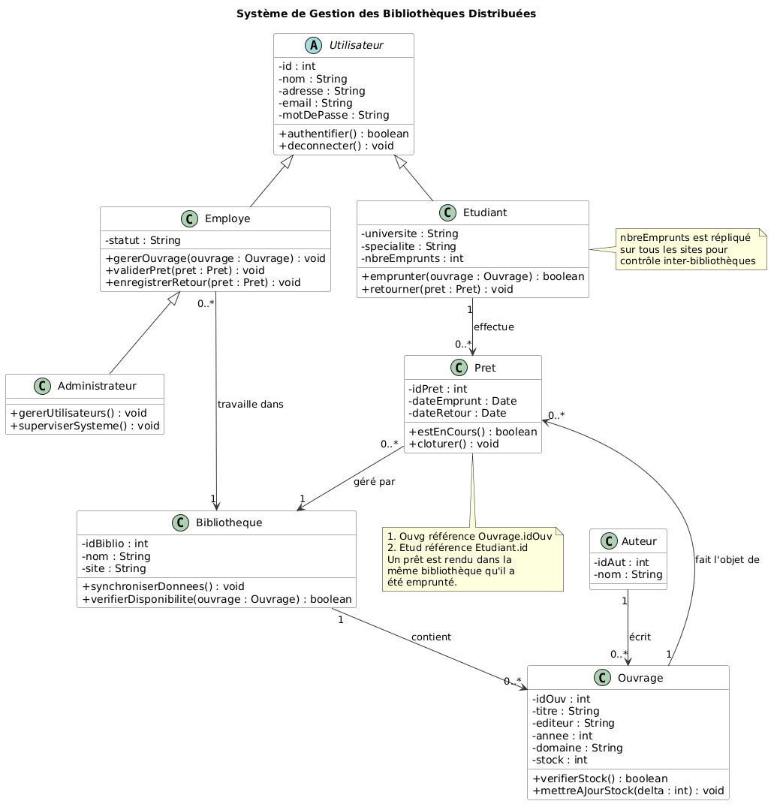

# 📚 Gestion des Bibliothèques Mutualisées — Base de Données Répartie

## 🎯 Objectif du projet

Trois universités sénégalaises (**UGB**, **UCAD**, **UADB**) mutualisent leurs bibliothèques : un étudiant de n'importe laquelle des 3 universités peut consulter et emprunter un ouvrage dans n'importe quelle bibliothèque du réseau.

Ce projet met en œuvre concrètement une **base de données répartie** : fragmentation horizontale des données sur 3 sites, réplication de la table de référence `AUTEUR`, et **transaction distribuée** pour le cas où un étudiant emprunte un ouvrage détenu par un site différent du sien.

> Note : ce README documente l'architecture réellement implémentée ici — un **codebase Spring Boot unique**, lancé en **3 instances** (une par site), chacune avec sa propre base **H2** embarquée, communiquant en REST. C'est une architecture simplifiée mais fonctionnelle, réalisable et démontrable rapidement, qui illustre les mêmes principes qu'une architecture microservices complète (Eureka + Gateway + PostgreSQL + Docker), sans la lourdeur d'infrastructure que celle-ci demande.

---

## 🏗️ Architecture du système

```
┌─────────────────────┐     ┌─────────────────────┐     ┌─────────────────────┐
│   Site UGB (8081)   │◄───►│  Site UCAD (8082)   │◄───►│  Site UADB (8083)   │
│  Spring Boot         │     │  Spring Boot         │     │  Spring Boot         │
│  --spring.profiles   │REST │  --spring.profiles   │REST │  --spring.profiles   │
│  .active=ugb          │◄──►│  .active=ucad         │◄──►│  .active=uadb         │
├─────────────────────┤     ├─────────────────────┤     ├─────────────────────┤
│ H2 : ./data/ugb.mv.db │     │ H2 : ./data/ucad.mv.db│     │ H2 : ./data/uadb.mv.db│
│ EMPLOYE_UGB           │     │ EMPLOYE_UCAD          │     │ EMPLOYE_UADB          │
│ ETUDIANT_UGB          │     │ ETUDIANT_UCAD         │     │ ETUDIANT_UADB         │
│ OUVRAGE_UGB           │     │ OUVRAGE_UCAD          │     │ OUVRAGE_UADB          │
│ PRET_UGB              │     │ PRET_UCAD             │     │ PRET_UADB             │
│ AUTEUR (répliquée)    │     │ AUTEUR (répliquée)    │     │ AUTEUR (répliquée)    │
└─────────────────────┘     └─────────────────────┘     └─────────────────────┘
          ▲                           ▲                           ▲
          └───────────────────────────┴───────────────────────────┘
                                      │
                              Frontend React (Vite)
                     sélecteur de site → interroge le port 8081/8082/8083
```

Les 3 instances partagent **exactement le même jar** ; seul le profil Spring actif change leur port, leur fichier H2 et leur identité (`site.code`). Chaque instance connaît l'URL des 2 autres (fichiers `application-<site>.yml`) pour le fan-out de recherche et les transactions distribuées.

### Diagramme de cas d'utilisation



### Diagramme de classes



---

## 📊 Modèle de données

```
EMPLOYE  (id, nom, prenom, poste, site)
ETUDIANT (id, nom, prenom, universite, nbreEmprunts)
OUVRAGE  (id, titre, idAuteur, site, disponible)
AUTEUR   (id [UUID], nom, prenom, nationalite)
PRET     (id, idOuvrage, titreOuvrage, idEtudiant, nomEtudiant, prenomEtudiant,
          universiteEtudiant, dateEmprunt, dateRetour, statut)
```

### Fragmentation horizontale

| Table | Fragment UGB | Fragment UCAD | Fragment UADB |
|---|---|---|---|
| EMPLOYE | σ site='UGB' (EMPLOYE) | σ site='UCAD' (EMPLOYE) | σ site='UADB' (EMPLOYE) |
| ETUDIANT | σ universite='UGB' (ETUDIANT) | σ universite='UCAD' (ETUDIANT) | σ universite='UADB' (ETUDIANT) |
| OUVRAGE | σ site='UGB' (OUVRAGE) | σ site='UCAD' (OUVRAGE) | σ site='UADB' (OUVRAGE) |
| PRET | PRET ⋉ OUVRAGE_UGB | PRET ⋉ OUVRAGE_UCAD | PRET ⋉ OUVRAGE_UADB |
| AUTEUR | répliquée intégralement sur les 3 sites (peu volumineuse, peu modifiée, très lue) | | |

`PRET` est fragmentée de façon **dérivée** par rapport à `OUVRAGE`, et non par rapport à `ETUDIANT` : la règle métier retenue est qu'un ouvrage emprunté dans une bibliothèque est rendu dans la même bibliothèque, donc c'est le site de l'ouvrage qui traite et stocke le prêt, quelle que soit l'université de l'étudiant emprunteur.

### Allocation des fragments

| Fragment | UGB | UCAD | UADB | Justification |
|---|:---:|:---:|:---:|---|
| EMPLOYE_x / ETUDIANT_x / OUVRAGE_x / PRET_x | ✅ site x | ✅ site x | ✅ site x | Géré et consulté localement, jamais partagé |
| AUTEUR | ✅ | ✅ | ✅ | Répliquée : petite table, peu écrite, lue par tous les sites via les ouvrages dispersés |

---

## 🔄 Transaction distribuée (le point délicat)

Le compteur `nbreEmprunts` vit dans `ETUDIANT`, alloué au site de l'université de l'étudiant. Mais le prêt est toujours traité par le site de l'ouvrage. Quand ces deux sites diffèrent, il faut une transaction distribuée.

**Stratégie implémentée** (saga applicative avec compensation, cf. `EmpruntService`) :

1. Le site de l'ouvrage vérifie la disponibilité localement.
2. Il crée le `PRET` localement et passe l'ouvrage à `disponible = false`.
3. **Cas local** (étudiant de ce même site) : incrémentation de `nbreEmprunts` dans la même transaction locale.
4. **Cas distant** : appel REST `POST /api/internal/etudiants/ajuster-compteur` vers le site de l'étudiant.
   - Succès → transaction terminée, système cohérent sur les 2 sites.
   - Échec (site distant injoignable) → **compensation** : le prêt est annulé et l'ouvrage repassé `disponible = true` sur le site local, pour ne jamais laisser un prêt enregistré sans que le compteur ne soit incrémenté nulle part.

Un vrai protocole 2PC (prepare/commit coordonné) serait plus robuste mais demande une infrastructure de coordination (ex. Atomikos/XA) hors de portée pour ce projet ; la compensation applicative est la solution pragmatique retenue et documentée.

---

## 📁 Structure du projet

```
biblio-repartie/
├── backend/
│   ├── pom.xml
│   └── src/main/
│       ├── java/sn/uadb/biblio/
│       │   ├── BiblioRepartieApplication.java
│       │   ├── config/         (SiteProperties, AppConfig : RestTemplate + CORS)
│       │   ├── entity/         (Employe, Etudiant, Ouvrage, Auteur, Pret)
│       │   ├── repository/     (5 repositories JPA)
│       │   ├── dto/            (EmpruntRequest, AjusterCompteurRequest, OuvrageGlobalDTO, ErrorResponse)
│       │   ├── service/        (EmpruntService, RechercheGlobaleService, SiteClientService)
│       │   ├── controller/     (Employe, Etudiant, Ouvrage, Auteur, Pret, Emprunt, Internal, SiteInfo)
│       │   └── exception/      (GlobalExceptionHandler)
│       └── resources/
│           ├── application.yml
│           ├── application-ugb.yml
│           ├── application-ucad.yml
│           └── application-uadb.yml
├── frontend/                   (application React)
└── docs/
    └── images/                 (diagrammes de conception)
```

---

## 🚀 Lancement du projet

### Prérequis
- Java 17+
- Maven
- Node.js (pour le frontend)

### Démarrer les 3 sites (3 terminaux séparés)

```bash
cd backend

# Terminal 1 — site UGB
mvn spring-boot:run -Dspring-boot.run.profiles=ugb

# Terminal 2 — site UCAD
mvn spring-boot:run -Dspring-boot.run.profiles=ucad

# Terminal 3 — site UADB
mvn spring-boot:run -Dspring-boot.run.profiles=uadb
```

### URLs

| Site | Port | Console H2 |
|---|---|---|
| UGB | http://localhost:8081 | http://localhost:8081/h2-console |
| UCAD | http://localhost:8082 | http://localhost:8082/h2-console |
| UADB | http://localhost:8083 | http://localhost:8083/h2-console |

### Frontend

```bash
cd frontend
npm install
npm run dev
```

Le frontend propose un sélecteur de site qui redirige les appels vers le port 8081, 8082 ou 8083 selon le site actif.

---

## 📡 Principaux endpoints

| Endpoint | Méthode | Description |
|---|---|---|
| `/api/site` | GET | Infos du site courant + sites connus |
| `/api/employes` | GET / POST / DELETE | CRUD employés (local) |
| `/api/etudiants` | GET / POST | CRUD étudiants (local) |
| `/api/ouvrages` | GET / POST | CRUD ouvrages (local) |
| `/api/ouvrages/recherche-locale?titre=` | GET | Recherche locale (cible du fan-out) |
| `/api/ouvrages/recherche-globale?titre=` | GET | Recherche sur les 3 sites (fan-out) |
| `/api/auteurs` | GET / POST | Gestion des auteurs (répliqués) |
| `/api/prets` | GET | Liste des prêts traités par ce site |
| `/api/emprunts` | POST | Créer un emprunt (déclenche la transaction distribuée si besoin) |
| `/api/emprunts/{idPret}/retour` | POST | Retourner un ouvrage |
| `/api/internal/etudiants/ajuster-compteur` | POST | Appel interne inter-site (ajustement `nbreEmprunts`) |

---

## 🧪 Exemple de test — emprunt inter-sites

```bash
# Étudiant UGB (id=1) emprunte un ouvrage détenu par UCAD (port 8082)
curl -X POST http://localhost:8082/api/emprunts \
  -H "Content-Type: application/json" \
  -d '{
    "idOuvrage": 1,
    "idEtudiant": 1,
    "universiteEtudiant": "UGB",
    "nomEtudiant": "Diop",
    "prenomEtudiant": "Awa"
  }'

# Vérifier que nbreEmprunts a bien été incrémenté à distance sur UGB (port 8081)
curl http://localhost:8081/api/etudiants/1
```

---

## 👥 Auteur

Projet universitaire — Base de données répartie, systèmes de bibliothèques inter-universités UGB / UCAD / UADB.
