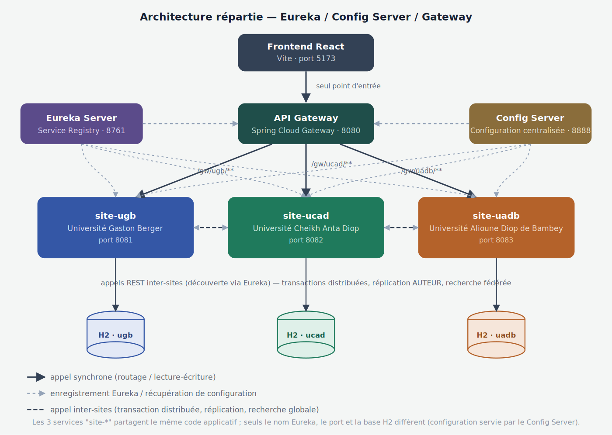

# 📚 Gestion des Bibliothèques Mutualisées — Base de Données Répartie

## 🎯 Objectif du projet

Trois universités sénégalaises (**UGB**, **UCAD**, **UADB**) mutualisent leurs bibliothèques : un étudiant de n'importe laquelle des 3 universités peut consulter et emprunter un ouvrage dans n'importe quelle bibliothèque du réseau.

Ce projet met en œuvre concrètement une **base de données répartie** : fragmentation horizontale des données sur 3 sites, réplication de la table de référence `AUTEUR`, et **transaction distribuée** pour le cas où un étudiant emprunte un ouvrage détenu par un site différent du sien.

> Note : ce README documente l'architecture **microservices** réellement implémentée — un **Eureka Server** (annuaire de services), un **Config Server** (configuration centralisée) et une **API Gateway** (point d'entrée unique) orchestrent 3 services **site-ugb**, **site-ucad**, **site-uadb**, chacun avec sa propre base **H2** embarquée et enregistré indépendamment auprès d'Eureka.

---

## 🏗️ Architecture du système



- **Eureka Server** (`8761`) : annuaire de services. Chaque service (`gateway`, `site-ugb`, `site-ucad`, `site-uadb`) s'y enregistre au démarrage et l'interroge pour localiser les autres — plus besoin d'URLs codées en dur pour les appels inter-sites.
- **Config Server** (`8888`) : centralise la configuration (port, nom de service, datasource H2, etc.) de chaque service dans un dépôt de configuration unique, servie au démarrage via `spring-cloud-config-client`.
- **API Gateway** (`8080`) : unique point d'entrée exposé au frontend. Route chaque requête vers le bon site en fonction du préfixe d'URL (`/gw/ugb/**`, `/gw/ucad/**`, `/gw/uadb/**`) et résout la destination dynamiquement via Eureka (`lb://site-ugb`, etc.).
- **site-ugb / site-ucad / site-uadb** (`8081` / `8082` / `8083`) : même code applicatif, déployé 3 fois sous 3 noms de service Eureka distincts. Chacun gère sa base H2 locale et communique directement avec les 2 autres (découverts via Eureka) pour les transactions distribuées, la réplication de `AUTEUR` et la recherche fédérée.
- **Frontend React** : ne connaît que l'URL de la Gateway ; il ignore totalement sur quel site physique se trouve chaque donnée (transparence de répartition).

### Diagramme de cas d'utilisation


### Diagramme de classes


---

## 📊 Modèle de données

```
EMPLOYE  (id, nom, prenom, poste, site)
ETUDIANT (id, nom, prenom, universite, nbreEmprunts)
OUVRAGE  (id, titre, idAuteur, site, disponible)
AUTEUR   (id [UUID], nom, prenom, nationalite)
PRET     (id, idOuvrage, titreOuvrage, idEtudiant, nomEtudiant, prenomEtudiant,
          universiteEtudiant, dateEmprunt, dateRetour, statut)
```

### Fragmentation horizontale

| Table | Fragment UGB | Fragment UCAD | Fragment UADB |
|---|---|---|---|
| EMPLOYE | σ site='UGB' (EMPLOYE) | σ site='UCAD' (EMPLOYE) | σ site='UADB' (EMPLOYE) |
| ETUDIANT | σ universite='UGB' (ETUDIANT) | σ universite='UCAD' (ETUDIANT) | σ universite='UADB' (ETUDIANT) |
| OUVRAGE | σ site='UGB' (OUVRAGE) | σ site='UCAD' (OUVRAGE) | σ site='UADB' (OUVRAGE) |
| PRET | PRET ⋉ OUVRAGE_UGB | PRET ⋉ OUVRAGE_UCAD | PRET ⋉ OUVRAGE_UADB |
| AUTEUR | répliquée intégralement sur les 3 sites (peu volumineuse, peu modifiée, très lue) | | |

`PRET` est fragmentée de façon **dérivée** par rapport à `OUVRAGE`, et non par rapport à `ETUDIANT` : la règle métier retenue est qu'un ouvrage emprunté dans une bibliothèque est rendu dans la même bibliothèque, donc c'est le site de l'ouvrage qui traite et stocke le prêt, quelle que soit l'université de l'étudiant emprunteur.

### Allocation des fragments

| Fragment | UGB | UCAD | UADB | Justification |
|---|:---:|:---:|:---:|---|
| EMPLOYE_x / ETUDIANT_x / OUVRAGE_x / PRET_x | ✅ site x | ✅ site x | ✅ site x | Géré et consulté localement, jamais partagé |
| AUTEUR | ✅ | ✅ | ✅ | Répliquée : petite table, peu écrite, lue par tous les sites via les ouvrages dispersés |

---

## 🔄 Transaction distribuée (le point délicat)

Le compteur `nbreEmprunts` vit dans `ETUDIANT`, alloué au site de l'université de l'étudiant. Mais le prêt est toujours traité par le site de l'ouvrage. Quand ces deux sites diffèrent, il faut une transaction distribuée.

**Stratégie implémentée** (saga applicative avec compensation, cf. `EmpruntService`) :

1. Le site de l'ouvrage vérifie la disponibilité localement.
2. Il crée le `PRET` localement et passe l'ouvrage à `disponible = false`.
3. **Cas local** (étudiant de ce même site) : incrémentation de `nbreEmprunts` dans la même transaction locale.
4. **Cas distant** : appel REST `POST /api/internal/etudiants/ajuster-compteur` vers le site de l'étudiant, **résolu via Eureka** (le service appelant ne connaît que le nom logique `site-ugb`/`site-ucad`/`site-uadb`, pas une URL fixe).
   - Succès → transaction terminée, système cohérent sur les 2 sites.
   - Échec (site distant injoignable ou absent d'Eureka) → **compensation** : le prêt est annulé et l'ouvrage repassé `disponible = true` sur le site local, pour ne jamais laisser un prêt enregistré sans que le compteur ne soit incrémenté nulle part.

Un vrai protocole 2PC (prepare/commit coordonné) serait plus robuste mais demande une infrastructure de coordination (ex. Atomikos/XA) hors de portée pour ce projet ; la compensation applicative est la solution pragmatique retenue et documentée.

---

## 📁 Structure du projet

```
biblio-repartie/
├── eureka-server/               (annuaire de services — Spring Cloud Netflix Eureka)
│   ├── pom.xml
│   └── src/main/java/.../EurekaServerApplication.java
├── config-server/                (configuration centralisée — Spring Cloud Config)
│   ├── pom.xml
│   ├── src/main/java/.../ConfigServerApplication.java
│   └── config-repo/              (application-site-ugb.yml, application-site-ucad.yml, application-site-uadb.yml, application-gateway.yml)
├── gateway/                       (point d'entrée unique — Spring Cloud Gateway)
│   ├── pom.xml
│   └── src/main/java/.../GatewayApplication.java
├── backend/                       (code applicatif partagé des 3 sites)
│   ├── pom.xml
│   └── src/main/
│       ├── java/sn/uadb/biblio/
│       │   ├── BiblioRepartieApplication.java
│       │   ├── config/         (SiteProperties, AppConfig : RestTemplate @LoadBalanced + CORS)
│       │   ├── entity/         (Employe, Etudiant, Ouvrage, Auteur, Pret)
│       │   ├── repository/     (5 repositories JPA)
│       │   ├── dto/            (EmpruntRequest, AjusterCompteurRequest, OuvrageGlobalDTO, ErrorResponse)
│       │   ├── service/        (EmpruntService, RechercheGlobaleService, SiteClientService)
│       │   ├── controller/     (Employe, Etudiant, Ouvrage, Auteur, Pret, Emprunt, Internal, SiteInfo)
│       │   └── exception/      (GlobalExceptionHandler)
│       └── resources/
│           ├── application.yml            (commun : nom logique récupéré via spring.application.name)
│           ├── bootstrap.yml               (adresse du Config Server + Eureka)
│           ├── application-ugb.yml
│           ├── application-ucad.yml
│           └── application-uadb.yml
├── frontend/                      (application React — n'appelle QUE la Gateway, port 8080)
└── docs/
    └── images/                    (diagrammes de conception, dont architecture.png)
```

---

## 🚀 Lancement du projet

### Prérequis
- Java 17+
- Maven
- Node.js (pour le frontend)

### Ordre de démarrage (important)

Les services dépendent les uns des autres au démarrage : **Config Server** doit répondre avant que les autres services ne récupèrent leur configuration, et **Eureka** doit être debout avant que les services ne s'y enregistrent.

```bash
# 1) Eureka Server
cd eureka-server && mvn spring-boot:run

# 2) Config Server
cd config-server && mvn spring-boot:run

# 3) Les 3 sites (3 terminaux séparés, une fois Eureka + Config prêts)
cd backend && mvn spring-boot:run -Dspring-boot.run.profiles=ugb
cd backend && mvn spring-boot:run -Dspring-boot.run.profiles=ucad
cd backend && mvn spring-boot:run -Dspring-boot.run.profiles=uadb

# 4) La Gateway (une fois les sites enregistrés sur Eureka)
cd gateway && mvn spring-boot:run
```

Vérifier que les 4 services (gateway + 3 sites) apparaissent bien dans le tableau de bord Eureka avant de lancer le frontend.

### URLs

| Service | Port | Rôle |
|---|---|---|
| Eureka Server | http://localhost:8761 | Tableau de bord des instances enregistrées |
| Config Server | http://localhost:8888 | Configuration centralisée (interrogeable en JSON) |
| API Gateway | http://localhost:8080 | **Seul point d'entrée pour le frontend** |
| site-ugb | http://localhost:8081 | Accessible en direct pour debug (H2 console incluse) |
| site-ucad | http://localhost:8082 | idem |
| site-uadb | http://localhost:8083 | idem |

### Frontend

```bash
cd frontend
npm install
npm run dev
```

Le frontend n'appelle que `http://localhost:8080` (la Gateway) ; le sélecteur de site change uniquement le préfixe de route (`/gw/ugb`, `/gw/ucad`, `/gw/uadb`), la résolution vers l'instance physique étant déléguée à la Gateway via Eureka.

---

## 📡 Principaux endpoints (via la Gateway, port 8080)

| Endpoint | Méthode | Description |
|---|---|---|
| `/gw/{site}/api/site` | GET | Infos du site courant + sites connus |
| `/gw/{site}/api/employes` | GET / POST / DELETE | CRUD employés (local) |
| `/gw/{site}/api/etudiants` | GET / POST | CRUD étudiants (local) |
| `/gw/{site}/api/ouvrages` | GET / POST | CRUD ouvrages (local) |
| `/gw/{site}/api/ouvrages/recherche-locale?titre=` | GET | Recherche locale (cible du fan-out) |
| `/gw/{site}/api/ouvrages/recherche-globale?titre=` | GET | Recherche sur les 3 sites (fan-out via Eureka) |
| `/gw/{site}/api/auteurs` | GET / POST | Gestion des auteurs (répliqués) |
| `/gw/{site}/api/prets` | GET | Liste des prêts traités par ce site |
| `/gw/{site}/api/emprunts` | POST | Créer un emprunt (déclenche la transaction distribuée si besoin) |
| `/gw/{site}/api/emprunts/{idPret}/retour` | POST | Retourner un ouvrage |
| `/api/internal/etudiants/ajuster-compteur` | POST | Appel interne **inter-sites** (résolu via Eureka, pas exposé par la Gateway) |

`{site}` vaut `ugb`, `ucad` ou `uadb` selon l'université ciblée.

---

## 🧪 Exemple de test — emprunt inter-sites

```bash
# Étudiant UGB (id=1) emprunte un ouvrage détenu par UCAD, via la Gateway
curl -X POST http://localhost:8080/gw/ucad/api/emprunts \
  -H "Content-Type: application/json" \
  -d '{
    "idOuvrage": 1,
    "idEtudiant": 1,
    "universiteEtudiant": "UGB",
    "nomEtudiant": "Diop",
    "prenomEtudiant": "Awa"
  }'

# Vérifier que nbreEmprunts a bien été incrémenté à distance sur UGB
curl http://localhost:8080/gw/ugb/api/etudiants/1
```

---

## 👥 Auteur

Projet universitaire — Base de données répartie, systèmes de bibliothèques inter-universités UGB / UCAD / UADB.
